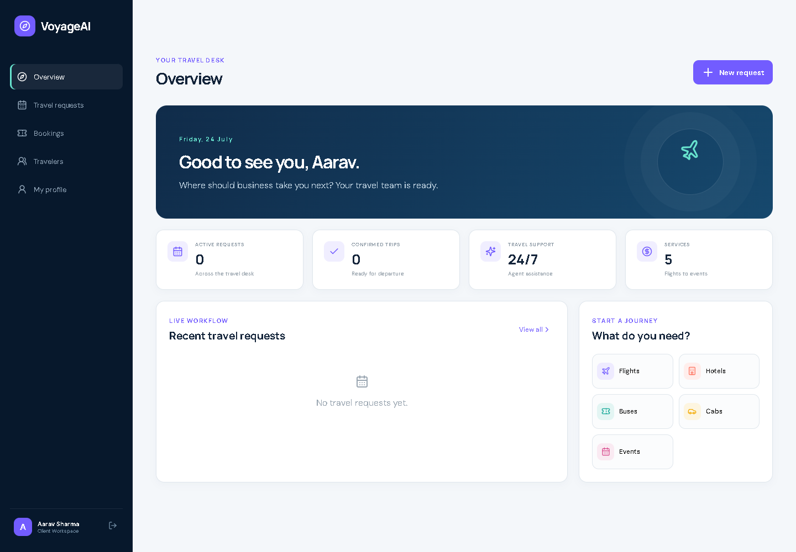
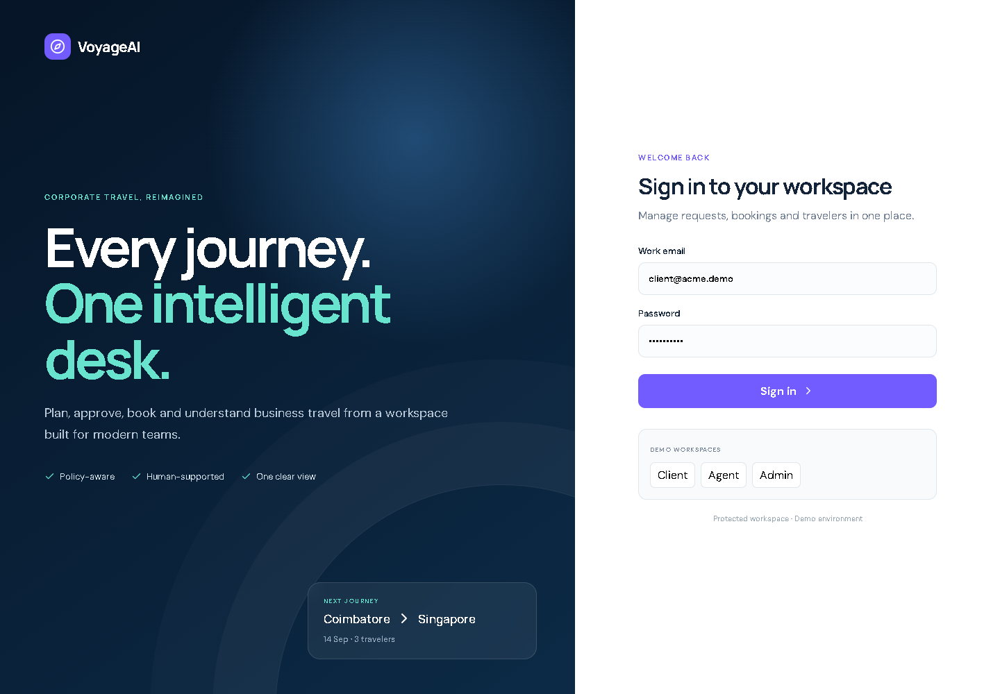
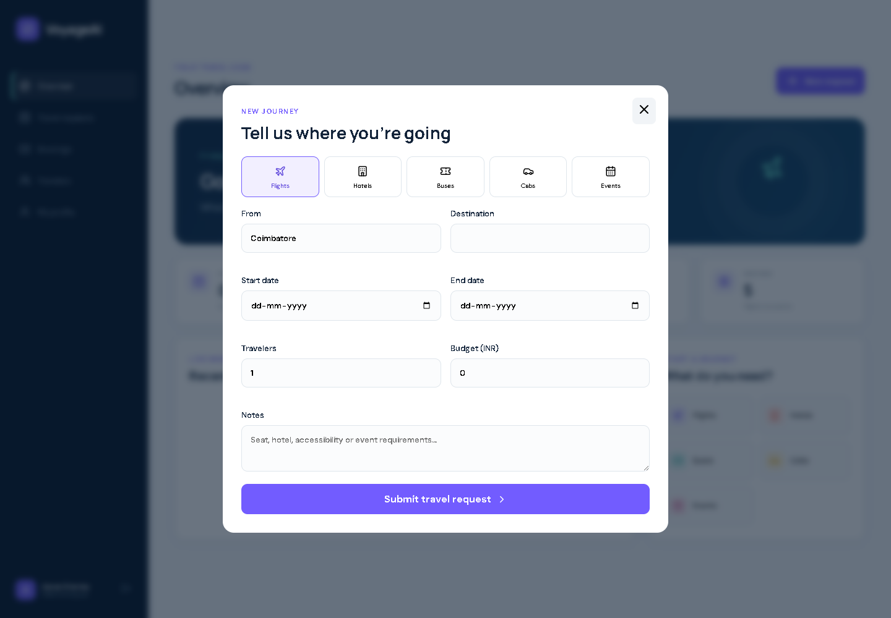
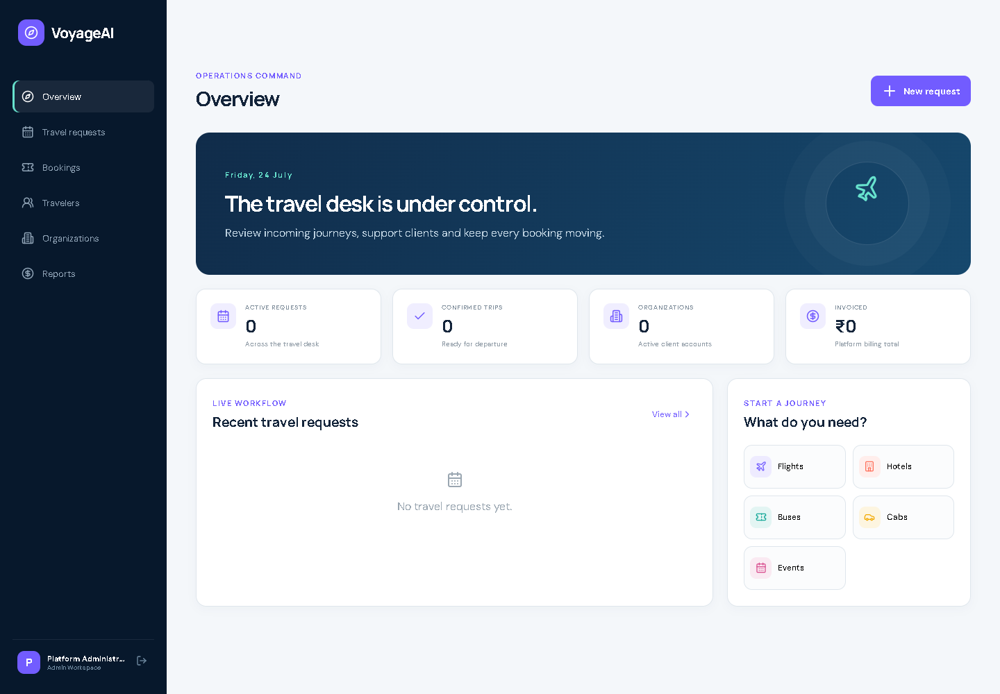

# VoyageAI — B2B Travel Management Platform

[](#testing)
[](#testing)
[](https://nextjs.org/)
[](https://fastapi.tiangolo.com/)
[](https://www.postgresql.org/)
[](https://voyageai-b2b-travel.atsdev7.chatgpt.site)

VoyageAI is a full-stack B2B travel request, booking, payment, invoice, and
reporting platform for corporate clients, travel agents, and administrators.
It combines a Next.js web application, a Python FastAPI service, PostgreSQL,
and an Expo/React Native mobile client.

The application currently runs with deterministic demo travel inventory and
sandbox payments. Its provider adapters are designed for approved flight,
hotel, transport, event, and payment integrations.

## Live deployment

**Public demo:** [voyageai-b2b-travel.atsdev7.chatgpt.site](https://voyageai-b2b-travel.atsdev7.chatgpt.site)

The hosted demo runs the Next.js client in browser-local demo mode. It is safe
to explore with the [demo accounts](#demo-accounts): requests, profile changes,
organizations, and users are stored only in that browser. The hosted demo does
not process real payments or connect to live airline/hotel inventory.

For a production installation, deploy the FastAPI API and PostgreSQL database,
configure provider credentials, and point `NEXT_PUBLIC_API_URL` at the secured
API. See [Deployment details](docs/DEPLOYMENT.md) for architecture, environment
variables, verification, and release instructions.



## Screenshots

| Secure login | Create a travel request |
|---|---|
|  |  |

### Administrator operations dashboard



> All screenshots and seeded records use fictional demonstration data.

## Product roles

### Client

- Sign in to an organization workspace
- Create hotel, flight, bus, cab, event, or package requests
- View submitted and historical travel requests
- Modify requests while they are submitted or under review
- Update profile, phone, job title, seat, meal, and travel preferences
- View bookings and invoices
- Create and confirm sandbox payment orders
- Request AI-assisted destination itineraries

### Travel agent

- View travel requests across client organizations
- Review, quote, approve, assign, cancel, and book requests
- Search normalized inventory across travel services
- Create booking confirmations and invoices
- View service, status, booking, and revenue summaries

### Administrator

- Perform all travel-agent workflows
- Create and manage organizations
- Onboard client users
- Access platform-wide operational and billing reports
- Manage role-protected B2B accounts

## Functional workflow

```text
Admin creates organization and client account
                       │
                       ▼
Client signs in and updates travel preferences
                       │
                       ▼
Client searches or submits a travel request
 hotel · flight · bus · cab · event · package
                       │
                       ▼
Agent reviews → quotes → obtains approval → books
                       │
                       ▼
Sandbox/real provider payment order and confirmation
                       │
                       ▼
Booking confirmation + tax invoice + reporting
```

Travel request lifecycle:

```text
submitted → reviewing → quoted → approved → booked
     └──────────────────────────────→ cancelled
```

## Where AI is used

The `/api/ai/itinerary` endpoint creates a day-by-day itinerary from:

- destination
- travel dates
- traveler interests
- available budget
- stored preferences

The current implementation uses an **explainable deterministic planning
engine**. It distributes interests across trip days, creates morning,
afternoon, and evening blocks, respects the trip duration, and returns a
clear safety/verification notice. This allows the application to operate
locally without sending resume, passport, or travel data to a third-party LLM.

```text
Destination + dates + interests + budget
                    │
                    ▼
         VoyageAI planning rules
                    │
                    ▼
     Structured day-by-day itinerary
```

The architecture can later add an LLM provider behind the same API contract for
natural-language refinement, policy-aware recommendations, disruption support,
and conversational travel assistance. A production AI integration must include
consent, redaction, prompt-injection protection, grounding, cost controls,
evaluation, audit logging, and a deterministic fallback. AI suggestions must
never be treated as confirmed availability or safety advice.

## Technology stack

| Layer | Technology | Purpose |
|---|---|---|
| Web | Next.js 16.2, React 19.2, App Router | Client, agent, and admin dashboards |
| UI | CSS design system, Lucide React | Responsive experience and icons |
| Mobile | Expo, React Native | Mobile login and travel request access |
| API | Python 3.12, FastAPI | REST workflows and OpenAPI documentation |
| Validation | Pydantic | Request and response validation |
| ORM | SQLAlchemy 2 | Database models and persistence |
| Production DB | PostgreSQL 16 | Multi-user transactional database |
| Local DB | SQLite | Zero-configuration development and tests |
| Authentication | JWT, PBKDF2-HMAC-SHA256 | Role-based authenticated sessions |
| HTTP integration | HTTPX | External travel and weather providers |
| Weather | Open-Meteo | Keyless destination weather context |
| Payments | Mock sandbox; Stripe/Razorpay-ready | Payment order workflow |
| Web testing | Vitest, React Testing Library, jsdom | Next.js component unit tests |
| API testing | pytest, FastAPI TestClient | Unit and workflow tests |
| Runtime | Docker Compose | Next.js, FastAPI, and PostgreSQL services |

## System architecture

```text
┌─────────────────────┐       ┌─────────────────────┐
│ Next.js web client  │       │ React Native mobile │
│ Client/Admin/Agent  │       │ Client workspace    │
└──────────┬──────────┘       └──────────┬──────────┘
           └──────────────┬──────────────┘
                          ▼
                ┌──────────────────┐
                │ FastAPI REST API │
                │ JWT + role rules │
                └────────┬─────────┘
                         │
          ┌──────────────┼────────────────┐
          ▼              ▼                ▼
 ┌────────────────┐ ┌────────────┐ ┌──────────────┐
 │ PostgreSQL 16  │ │ Travel API │ │ Payment API  │
 │ Organizations  │ │ adapters   │ │ adapters     │
 │ Users/Requests │ │ Mock first │ │ Sandbox first│
 │ Bookings/Bills │ └────────────┘ └──────────────┘
 └────────────────┘
```

See [Architecture](docs/ARCHITECTURE.md) and
[Product roadmap](docs/PRODUCT_ROADMAP.md).

## Requirements

### Local development

- Windows, macOS, or Linux
- Python 3.10 or newer; Python 3.12 recommended
- Node.js 20.9 or newer; Node.js 24 recommended
- npm 10 or newer
- Approximately 1 GB free disk space for dependencies

### Full production-like stack

- Docker Desktop or Docker Engine with Compose
- Ports `3000`, `8000`, and `5432` available
- At least 2 GB RAM available to containers

### External production providers

- Approved flight/hotel supplier or GDS account
- Approved regional bus, cab, and event supplier accounts
- Stripe or Razorpay merchant/test credentials
- HTTPS domain and webhook endpoints

## Quick start

### 1. Start FastAPI

```powershell
cd backend
python -m venv .venv
.\.venv\Scripts\Activate.ps1
python -m pip install -r requirements.txt
python -m uvicorn app.main:app --reload --port 8000
```

The API runs at `http://localhost:8000` and interactive OpenAPI documentation
is available at `http://localhost:8000/docs`.

Without `DATABASE_URL`, FastAPI uses `backend/voyageai.db`. For PostgreSQL,
copy `.env.example` to `.env` and update the credentials.

### 2. Start Next.js

Open another terminal:

```powershell
cd frontend
cmd /c npm install
cmd /c npm run dev
```

Open `http://localhost:3000`.

### 3. Start the mobile client

```powershell
cd mobile
cmd /c npm install
$env:EXPO_PUBLIC_API_URL="http://YOUR-LAN-IP:8000"
cmd /c npm start
```

Use `http://10.0.2.2:8000` for an Android emulator or the computer's LAN
address for a physical device.

## Docker and PostgreSQL

```powershell
docker compose up --build
```

Services:

| Service | Address |
|---|---|
| Next.js | `http://localhost:3000` |
| FastAPI | `http://localhost:8000` |
| OpenAPI | `http://localhost:8000/docs` |
| PostgreSQL | `localhost:5432` |

Change all development credentials and `JWT_SECRET` before a shared deployment.

## Demo accounts

| Role | Email | Password |
|---|---|---|
| Admin | `admin@voyageai.demo` | `Admin123!` |
| Agent | `agent@voyageai.demo` | `Agent123!` |
| Client | `client@acme.demo` | `Client123!` |

These accounts are created only when the users table is empty.

## Environment variables

| Variable | Required | Description |
|---|---:|---|
| `DATABASE_URL` | Production | SQLAlchemy PostgreSQL connection |
| `JWT_SECRET` | Production | Long random token-signing secret |
| `ACCESS_TOKEN_MINUTES` | No | Login lifetime; default `480` |
| `FRONTEND_ORIGIN` | Production | Allowed CORS origin |
| `NEXT_PUBLIC_API_URL` | Web | Browser-visible FastAPI base URL |
| `TRAVEL_PROVIDER` | No | `mock` by default |
| `AMADEUS_CLIENT_ID` | Provider | Amadeus test/production credential |
| `AMADEUS_CLIENT_SECRET` | Provider | Amadeus secret |
| `PAYMENT_PROVIDER` | No | `mock`, `stripe`, or `razorpay` |
| `STRIPE_SECRET_KEY` | Provider | Stripe server credential |
| `RAZORPAY_KEY_ID` | Provider | Razorpay key identifier |
| `RAZORPAY_KEY_SECRET` | Provider | Razorpay secret |
| `EXPO_PUBLIC_API_URL` | Mobile | Mobile-accessible API address |

Never commit `.env` files or production credentials.

## Travel and payment providers

There is no unlimited free production API that issues real flight, hotel, bus,
cab, and event tickets. The repository therefore provides:

- deterministic mock inventory for every service
- normalized internal offer objects
- Open-Meteo weather requests
- Amadeus credential placeholders
- sandbox payment orders and confirmation
- Stripe/Razorpay configuration placeholders

Production bookings require supplier contracts, live availability repricing,
ticket issuance, signed webhooks, refunds, exchanges, settlement, and
reconciliation.

## REST API

| Group | Important endpoints |
|---|---|
| Authentication | `POST /api/auth/login`, `GET /api/auth/me` |
| Profile | `PATCH /api/profile` |
| Organizations | `GET/POST /api/organizations` |
| Users | `GET/POST /api/users` |
| Search | `GET /api/travel/search` |
| Weather | `GET /api/weather` |
| Requests | `GET/POST /api/travel/requests` |
| Request changes | `PATCH /api/travel/requests/{id}` |
| Agent status | `PATCH /api/travel/requests/{id}/status` |
| Bookings | `GET/POST /api/bookings` |
| Payments | `POST /api/payments/{booking_id}/order` |
| Payment confirmation | `POST /api/payments/{payment_id}/confirm` |
| Invoices | `GET /api/invoices` |
| Reports | `GET /api/reports/summary` |
| AI itinerary | `POST /api/ai/itinerary` |

## Testing

### Run every backend test

```powershell
cd backend
python -m pytest -q
```

Verified result: **13 passed**.

Backend coverage includes:

- salted password hashing and password verification
- normalized inventory for all six service categories
- valid and invalid date ranges
- JWT login
- client request creation, listing, and modification
- profile and travel-preference updates
- organization and client onboarding
- admin reporting
- role-based access isolation
- input validation
- booking creation
- sandbox payment order and confirmation
- invoice and tax generation
- travel inventory search
- AI itinerary generation

### Run every Next.js component test

```powershell
cd frontend
cmd /c npm test
```

Verified result: **3 passed** in one test file.

Frontend tests cover:

- login screen and demo roles
- role selector credential updates
- successful client authentication
- dashboard rendering
- session persistence in local storage

### Verify the production web build

```powershell
cd frontend
cmd /c npm run build
```

Verified with Next.js `16.2.11`: compilation, type checking, page-data
collection, and static page generation all completed successfully.

## Project structure

```text
.
├── backend/
│   ├── app/main.py
│   ├── tests/test_api.py
│   ├── tests/test_units.py
│   ├── Dockerfile
│   ├── requirements.txt
│   └── .env.example
├── frontend/
│   ├── app/page.jsx
│   ├── app/layout.jsx
│   ├── app/globals.css
│   ├── tests/app.test.jsx
│   ├── tests/setup.js
│   ├── vitest.config.mjs
│   ├── next.config.mjs
│   ├── Dockerfile
│   └── package.json
├── mobile/
│   ├── App.js
│   ├── app.json
│   └── package.json
├── docs/
│   ├── ARCHITECTURE.md
│   ├── PRODUCT_ROADMAP.md
│   └── screenshots/
├── docker-compose.yml
└── README.md
```

## Production requirements

This repository is a tested MVP, not yet a certified ticketing or payment
system. A production launch additionally requires:

- Alembic-managed database migrations
- MFA, password reset, token refresh and revocation
- strict organization-level tenant isolation tests
- secrets management and key rotation
- verified provider and payment webhooks
- malware scanning for uploaded documents
- rate limiting and abuse protection
- encrypted storage and data-retention/deletion workflows
- backup and restore exercises
- observability, alerting, SLOs, and incident response
- supplier reconciliation, cancellations, refunds, and exchanges
- privacy, tax, accessibility, and regional legal review

## License and data

The source code is available under the [MIT License](LICENSE). No real customer
or traveler data is included. Before commercial use, verify the separate terms
for every travel, mapping, weather, payment, and AI provider.
